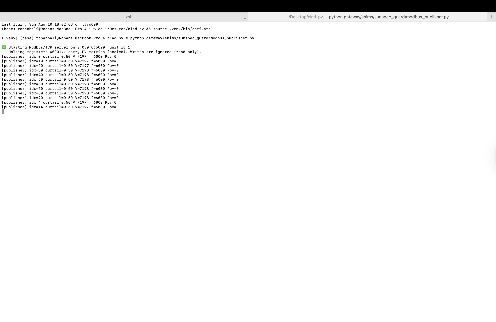
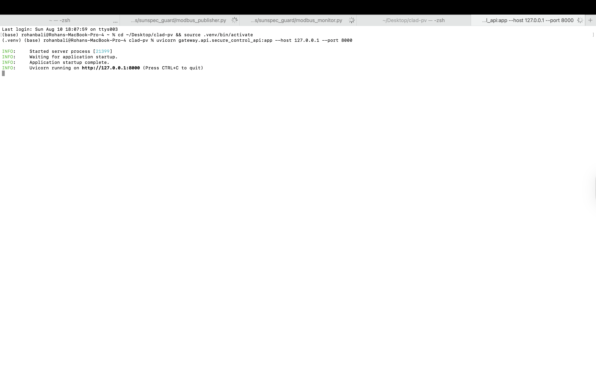
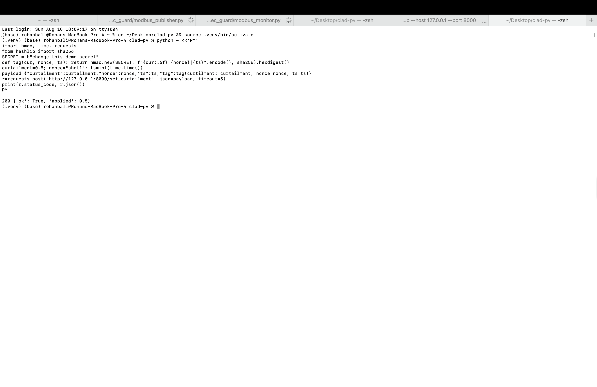
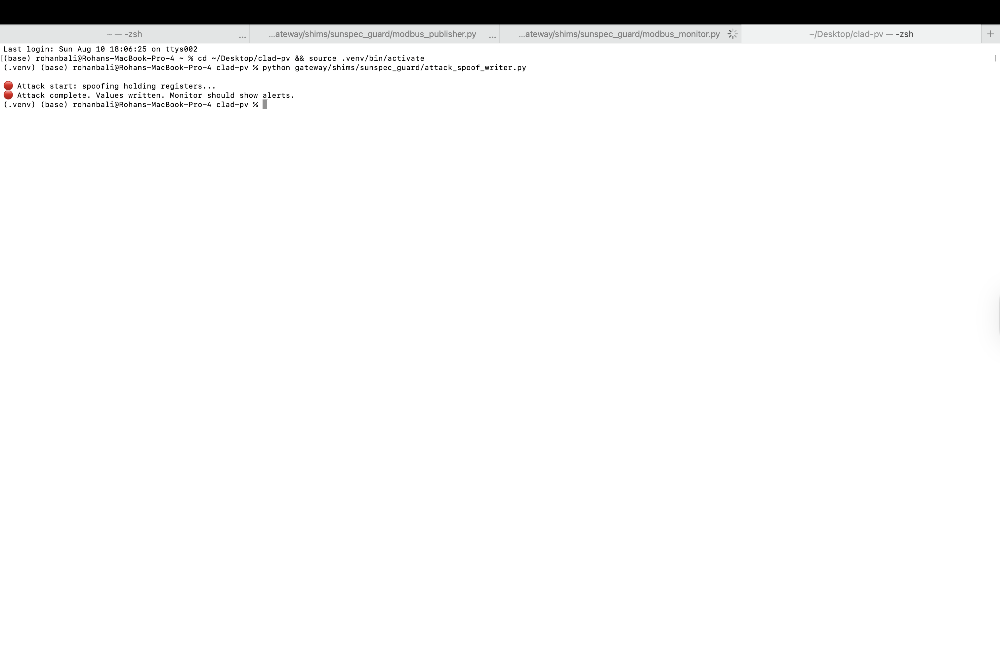
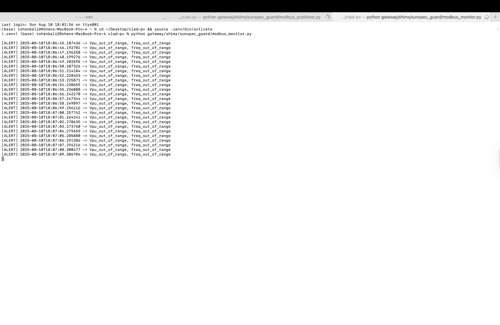
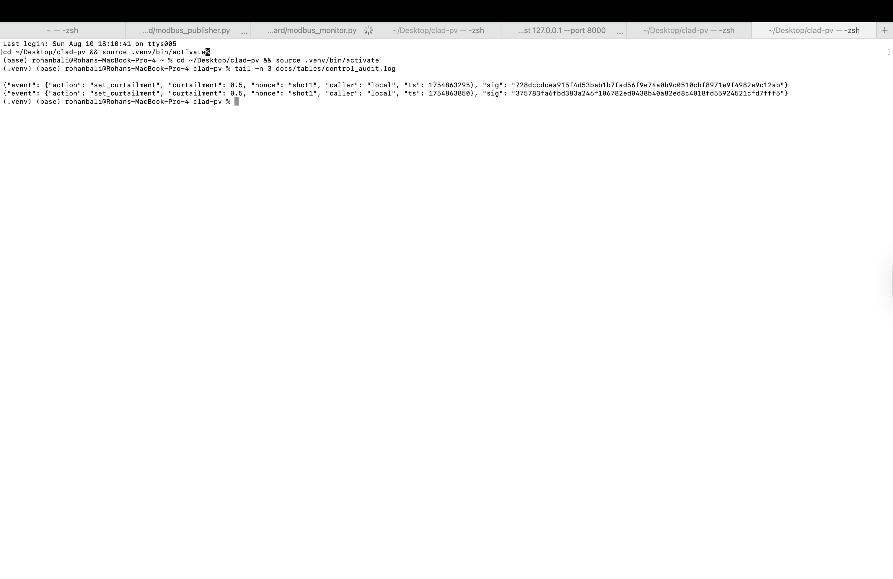

# CLAD-PV: Cybersecurity & Load-Aware Dispatch for Photovoltaics

## Overview
CLAD-PV is a **secure control and monitoring system** for photovoltaic (PV) infrastructure.  
It integrates **Modbus/TCP communication**, **secure API control**, and **real-time anomaly detection** to ensure safe, resilient, and optimal PV operations — even under cyber-attack conditions.

---

## Key Features

- **Secure Modbus/TCP Server**  
  Handles PV data exchange and prevents unauthorized write operations to sensitive registers.

- **Real-Time Curtailment Control**  
  API-driven PV power output adjustment with secure authentication.

- **Cyber-Attack Simulation & Mitigation**  
  Includes spoofed data injection testing to validate system resilience.

- **Anomaly Detection Alerts**  
  Monitors PV voltage, frequency, and power for out-of-range events.

- **Immutable Audit Logs**  
  Ensures security events are verifiable and tamper-proof.

---

## System Architecture
The architecture comprises:

1. **Modbus Publisher** – Publishes PV operational metrics.
2. **Secure Control API** – Allows authenticated curtailment commands.
3. **Attack Simulation Module** – Sends spoofed Modbus frames to test defense mechanisms.
4. **Modbus Monitor** – Detects anomalies in real time.
5. **Audit Logger** – Writes signed security events for compliance.

---

## Setup & Usage

### 1. Clone Repository
```bash
git clone https://github.com/rohanbalixz/clad-pv.git
cd clad-pv
```

### 2. Create Virtual Environment
```bash
python3 -m venv .venv
source .venv/bin/activate
pip install -r requirements.txt
```

### 3. Start Modbus Publisher
```bash
python gateway/shims/sunspec_guard/modbus_publisher.py
```


### 4. Start Secure Control API
```bash
python gateway/shims/sunspec_guard/secure_control_api.py
```


### 5. Send Curtailment Command
```bash
curl -X POST "http://127.0.0.1:8000/control"      -H "Content-Type: application/json"      -d '{"curtailment": 0.5}'
```


### 6. Simulate Attack
```bash
python gateway/shims/sunspec_guard/attack_spoof_writer.py
```


### 7. Monitor Alerts
```bash
python gateway/shims/sunspec_guard/modbus_monitor.py
```


### 8. View Signed Audit Logs


---

## Screenshots
| Feature | Screenshot |
|---------|------------|
| Modbus Publisher Started |  |
| Secure Control API Started |  |
| Curtailment API Success |  |
| Attack Spoof Execution |  |
| Monitor Alert Logs |  |
| Signed Audit Logs |  |

---

## Future Enhancements
- Integration with **cloud-based security monitoring dashboards**.
- Automatic **response and isolation mechanisms** for detected cyber-attacks.
- Extended protocol support beyond Modbus/TCP.

---

## License
MIT License. See `LICENSE` file for details.
